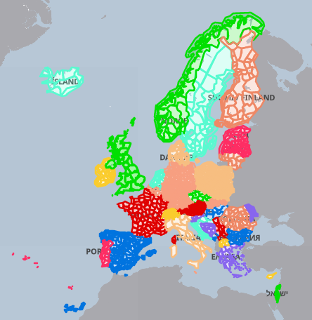

Weather Warnings from www.meteoalarm.org (EUMETNET member countries)
====================================================================

This script will read and cache a weather awareness warning from [**www.meteoalarm.org**](https://www.meteoalarm.org/) for a specified region(s) in a country that participates in [**EUMETNET**](https://www.eumetnet.eu.org/). The countries/areas in color are available.



As a standalone script, it can be configured to display the warning in any one of the supported languages of the member countries. When used within the [**AJAX/PHP Base-World template**](https://saratoga-weather.org/wxtemplates/index.php), the language for the template set will be automatically selected. Please note that the translations for the contents are provided by www.meteoalarm.org , and no additional translation is done by the World-ML template set..

Settings in the file for non-template use are:

```php
<?php
#-------------------------------------------------------------------------------------------------
# local default settings .. overridden by Settings.php entries
#-------------------------------------------------------------------------------------------------   
#$alarm_area = 'DK002';  # leave unset-- the $SITE['EUwarnings'] will configure it.
$cacheFileDir = './';   
$ourTZ = 'Europe/Brussels';   
$dateFormat = "Y-m-d";
$timeFormatShort = "h:i T";
# end local settings   
#-------------------------------------------------------------------------------------------------   
# end of configurable settings   
#-------------------------------------------------------------------------------------------------   
?>
```

For [**AJAX/PHP Base-World template**](https://saratoga-weather.org/wxtemplates/index.php) users, only two settings need to be changed in _Settings.php_.

```php
<?php   
// For Europe only, use the meteoalarm.org site for your area's watches/warnings on the wxadvisory page  
// $SITE['EUwarnings'] is used by get-meteoalarm-warning-inc.php V3.00 for EU countries   
// Go to https://saratoga-weather.org/meteoalarm-map/ to get the EMMA_ID code(s) for your area   
// and uncomment the following with your codes installed to activate the wxadvisory.php script.
#$SITE['EUwarnings'] = 'DK002,DK004,EE007';
$SITE['useMeteoalarm'] = true; // =true; to use get-meteoalarm-warning-inc.php for alerts; =false; if not
?>
```

To find the URL to use for _$alarm\_area_ (or _$SITE\['EUwarnings'\]_ in Settings.php), use your browser to open [**https://saratoga-weather.org/meteoalarm-map/**](https://saratoga-weather.org/meteoalarm-map/) website. Use the map search function to find an area, or just zoom in/drag the map until your location is shown. Mouse over the area to display the EMMA\_ID to use. Repeat as needed for additional areas.  
**Caution:** If additional areas are in other countries, be aware that each unique country code seen will require a data fetch from meteoalarm.org site and will delay the loading of the page to the visitor.

The **get-meteoalarm-warning-inc.php** script uses a cache file to store the return from the _$alarm\_area_ page. The script stores 3 files in the directory set by _$cacheFileDir_ (or _$SITE\['cacheFileDir'\]_ in the Saratoga template. The files are:

*   **meteoalarm.arr** - contains the serialized alerts array
*   **meteoalarm-detail.html** - contains the HTML for a detail display with tabbed displays for each alert
*   **meteoalarm-summary.html** - contains the HTML for a summary display with icons linked to the detail item on the detail page.

The script uses support files:

*   **meteoalarm-geocode-aliases.php** - array of NUTS2/NUTS3 area codes with EMMA\_ID aliases
*   **./ajax-alerts/meteoalarm\_\*.svg** - SVG icons used for alerts and info

The **get-meteoalarm-warning-inc.php** and **meteoalarm-geocode-aliases.php** scripts need to be in the same directory, and the SVG images in the **./ajax-alerts/** directory for proper operation.

Include the following text on your page to display the output:

```php
<?php
include_once("get-meteoalarm-warning-inc.php");
# for details use:
  if(file_exists('$warn_details')) { readfile('$warn_details'); }
# for summary use:        
  if(file_exists('$warn_summary')) { readfile('$warn_summary'); }
?>
```

**Note:** the Version 3.x of the script uses only UTF-8 character set (as that is all meteoalert.org uses).  
For use in the Saratoga templates, the individual page (wxindex.php and wxadvisory.php) MUST render in UTF-8 by using the
```php
$useUTF8 = true;
```
directive after the
```php
$TITLE = '....';
```
statement.

(note: this script is included with the [AJAX/PHP](https://saratoga-weather.org/wxtemplates/index.php) Base-World website template )
